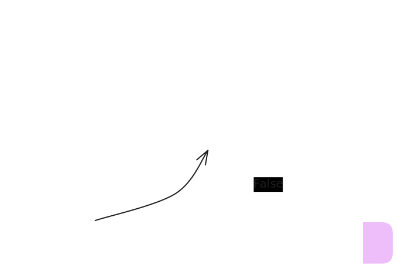

# RAG Agent - Stock Market Performance 2024

Este projeto implementa um agente de Geração Aumentada por Recuperação (RAG) utilizando **LangGraph** e **LangChain**. O agente foi projetado para responder perguntas sobre o desempenho do mercado de ações em 2024, utilizando um documento PDF como base de conhecimento.

## 📋 Funcionalidades

- **Processamento de Documentos**: Carrega e divide um arquivo PDF ("Stock_Market_Performance_2024.pdf") em chunks gerenciáveis.
- **Banco de Dados Vetorial**: Utiliza **ChromaDB** para armazenar embeddings gerados pela OpenAI, permitindo busca semântica eficiente.
- **Agente Inteligente**: Implementado com **LangGraph**, o agente decide dinamicamente quando consultar a base de conhecimento (retriever) ou responder diretamente.
- **Memória e Estado**: Gerencia o estado da conversa através de um grafo de estados.

## 🛠️ Tecnologias Utilizadas

- [LangChain](https://www.langchain.com/)
- [LangGraph](https://langchain-ai.github.io/langgraph/)
- [OpenAI API](https://openai.com/) (GPT-4o-mini, text-embedding-3-small)
- [ChromaDB](https://www.trychroma.com/)

## 🚀 Como Executar

### Pré-requisitos

- Python 3.9 ou superior.
- Uma chave de API da OpenAI.

### Instalação

1. Clone este repositório (se aplicável) ou navegue até a pasta do projeto.

2. Crie e ative um ambiente virtual (recomendado):
   ```bash
   python -m venv venv
   # No Windows:
   .\venv\Scripts\activate
   # No Linux/Mac:
   source venv/bin/activate
   ```

3. Instale as dependências:
   ```bash
   pip install -r requirements.txt
   ```

4. Configure as variáveis de ambiente:
   Crie um arquivo `.env` na raiz do projeto e adicione sua chave da OpenAI:
   ```env
   OPENAI_API_KEY=sua-chave-aqui
   ```

5. Certifique-se de que o arquivo `Stock_Market_Performance_2024.pdf` esteja na raiz do projeto.

### Uso

Execute o agente com o seguinte comando:

```bash
python RAG_Agent.py
```

O sistema irá carregar o PDF, criar (ou carregar) o banco de dados vetorial e iniciar um loop de interação onde você pode fazer perguntas.

Exemplo de interação:
```text
What is your question: How did the tech sector perform in 2024?
```

Para sair, digite `exit`, `quit` ou `q`.

## 📂 Estrutura do Projeto

- `RAG_Agent.py`: Script principal contendo a lógica do agente, configuração do ChromaDB e definição do grafo LangGraph.
- `requirements.txt`: Lista de bibliotecas Python necessárias.
- `Stock_Market_Performance_2024.pdf`: Documento fonte para o RAG.
- `agent.svg`: Representação visual do fluxo do agente.
- `chroma.sqlite3` e pasta com UUID: Arquivos de persistência do banco de dados vetorial (gerados após a primeira execução).

## 🧠 Como Funciona (Arquitetura)

O agente opera através de um grafo de estados (`StateGraph`) com o seguinte fluxo:

1. **Nó LLM (`llm`)**: Recebe a entrada do usuário. O modelo decide se precisa de mais informações externas.
2. **Decisão (`should_continue`)**: Verifica se o LLM solicitou o uso de uma ferramenta.
   - Se **SIM**: Passa para o nó `retriever_agent`.
   - Se **NÃO**: Finaliza a execução e apresenta a resposta.
3. **Nó Retriever (`retriever_agent`)**: Executa a busca no ChromaDB usando a query gerada pelo LLM e retorna os trechos relevantes do documento. O fluxo então retorna ao nó `llm` para processar a informação encontrada.


